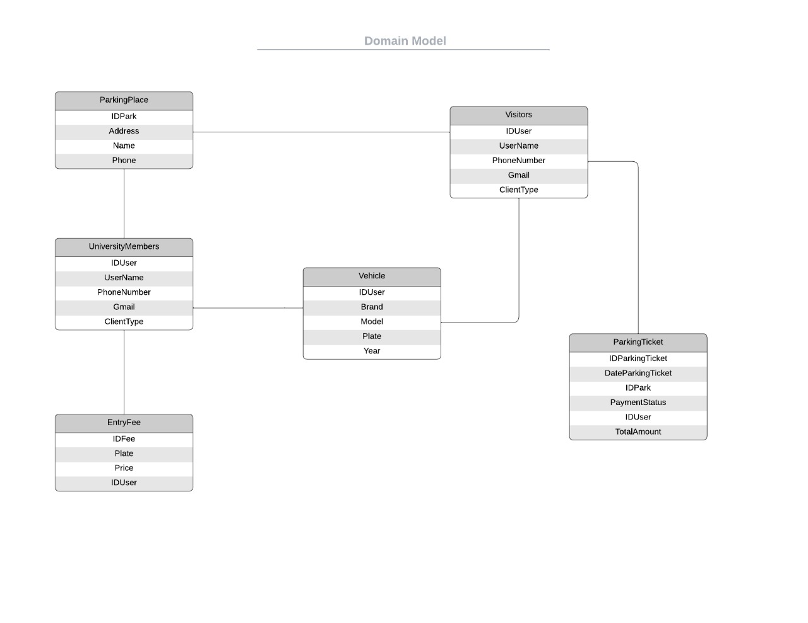
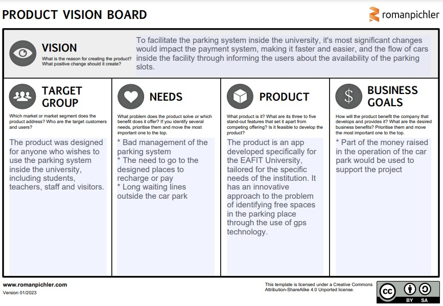

# Proyecto Integrador 1

## Integrantes

- [**Leidy Carolina Obando Figueroa**](https://github.com/caro0616)
- [**Samuel Aristizabal Alzate**](https://github.com/SamuelAristizabal)
- [**Jaider España Paternina**](https://github.com/jespanap)
- [**Sofia Zapata Zuluaga**](https://github.com/Alkran93)


## Descripción del Proyecto

[Breve descripción del proyecto. ¿Cuál es el objetivo principal? ¿Qué problemas resuelve?]

## Domain Model



[Descripción breve del modelo de dominio, explicando los elementos clave y su relación.]

## Visión del Producto



### **Propósito del Producto**

[Descripción clara de lo que se espera lograr con el producto]

## Tecnología

[Lista de las principales tecnologías y herramientas utilizadas en el proyecto]

## Instalación

[Pasos para clonar o instalar el proyecto]

```bash
git clone https://github.com/SamuelAristizabal/PaytoPark.git
